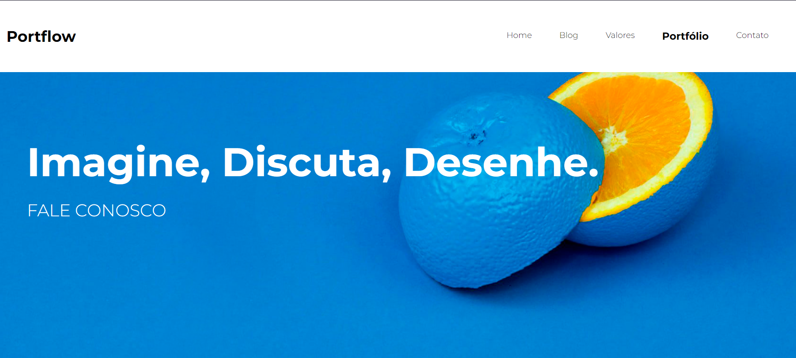

<h1 align="center">
    
</h1>

<h1 align="center">
   <a href="#">PortFlow</a>
</h1>

<h3 align="center">
    Criando um site responsivo, que contem uma galeria de produtos.
</h3>

  

  

  
    
   
   

<h4 align="center"> 
	 Status: Doing
</h4>

 <a href="#about">About</a> •
 <a href="#features">Features</a> •
 <a href="#author">Author</a> • 
 <a href="#user-content-license">License</a>

## About
front deploy link: https://leanderheitor.github.io/Portflow/

Atualmente responsivo em celulares.

---

## Features
- [X] Header
    - [X] Menu de navegação
- [X] Main
    - [X] Galeria de imagens
    - [X] Animação de imagens
- [X] Footer
    - [X] Redes sociais

---

## Author

<a href="#">
 
<h2>Heitor Leander</h2>

 

---

## License

This project is under the license [MIT](./LICENSE).

Feito por Heitor L.